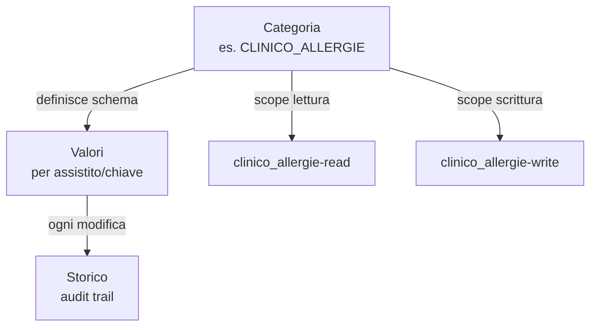

# Sistema Extra Data

## Panoramica

Il sistema Extra Data permette di aggiungere **dati dinamici strutturati** agli assistiti, organizzati per **categorie** con schema di validazione, versionamento e controllo accessi basato su scope.

## Architettura



## Modelli

| Modello | Tabella | Descrizione |
|---------|---------|-------------|
| `Anagrafica_ExtraDataCategorie` | `extra_data_categorie` | Definizioni categorie con schema campi |
| `Anagrafica_ExtraDataValori` | `extra_data_valori` | Valori correnti per assistito/categoria/chiave |
| `Anagrafica_ExtraDataStorico` | `extra_data_storico` | Audit trail di tutte le modifiche |

## Struttura Categoria

Ogni categoria definisce:

| Campo | Descrizione |
|-------|-------------|
| `codice` | Identificativo unico (es. `CLINICO_ALLERGIE`) |
| `descrizione` | Descrizione leggibile |
| `scopoLettura` | Scope richiesto per leggere (es. `clinico_allergie-read`) |
| `scopoScrittura` | Scope richiesto per scrivere |
| `campi` | JSON array con schema dei campi ammessi |
| `attivo` | Abilitazione categoria |

### Schema Campi

Ogni campo nella definizione ha:

```json
{
  "chiave": "nome_campo",
  "tipo": "string",
  "obbligatorio": true,
  "etichetta": "Etichetta visualizzata"
}
```

**Tipi supportati:** `string`, `number`, `boolean`, `date`, `json`

Il tipo `json` e' usato per dati multi-valore (es. lista allergie, lista terapie). Il contenuto JSON viene validato contro lo schema definito nella categoria tramite `api/helpers/validate-extra-data-json.js`.

## API Pubbliche

Tutte richiedono scope `asp5-anagrafica` + scope specifico della categoria.

### Leggere extra data

```
GET /api/v1/anagrafica/extra-data/:cf
GET /api/v1/anagrafica/extra-data/:cf?categoria=CLINICO_ALLERGIE
```

Risposta:
```json
{
  "ok": true,
  "data": {
    "CLINICO_ALLERGIE": {
      "lista": [{"sostanza": "Penicillina", "tipo": "farmaco", "criticita": "alta"}]
    },
    "ANAGRAFICA_CONTATTI": {
      "cellulare_1": "333...",
      "email": "mario@example.com"
    }
  }
}
```

> I dati restituiti sono filtrati automaticamente in base agli scope dell'utente.

### Scrivere extra data

```
POST /api/v1/anagrafica/extra-data/:cf
```

Body:
```json
{
  "categoria": "ANAGRAFICA_CONTATTI",
  "valori": {
    "cellulare_1": "3331234567",
    "email": "mario@example.com"
  }
}
```

### Eliminare extra data

```
DELETE /api/v1/anagrafica/extra-data/:cf
```

Body:
```json
{
  "categoria": "ANAGRAFICA_CONTATTI",
  "chiavi": ["cellulare_1"]
}
```

### Storico modifiche

```
GET /api/v1/anagrafica/extra-data/:cf/storico
GET /api/v1/anagrafica/extra-data/:cf/storico?categoria=CLINICO_ALLERGIE
```

### Lista categorie disponibili

```
GET /api/v1/anagrafica/extra-data-categorie/summary
```

## Categorie Disponibili

### Categorie Anagrafiche

| Codice | Descrizione | Tipo dati |
|--------|-------------|-----------|
| `ANAGRAFICA_CONTATTI` | Recapiti telefonici e email | Campi singoli |
| `ANAGRAFICA_NOTE` | Note generiche | Campi singoli |
| `ANAGRAFICA_EXTRA` | Stato civile, professione, titolo studio | Campi singoli |
| `ANAGRAFICA_CONTATTI_EMERGENZA` | Contatti di emergenza | Campi singoli |

### Categorie Cliniche

| Codice | Descrizione | Tipo dati |
|--------|-------------|-----------|
| `CLINICO_ALLERGIE` | Allergie e intolleranze | JSON lista |
| `CLINICO_PATOLOGIE` | Patologie croniche | JSON lista |
| `CLINICO_ESENZIONI` | Esenzioni SSN | JSON lista |
| `CLINICO_TERAPIE` | Terapie farmacologiche | JSON lista |
| `CLINICO_PARAMETRI_VITALI` | Parametri vitali | Campi singoli |
| `CLINICO_CONSENSI` | Consensi informati | JSON lista |
| `CLINICO_PRESA_IN_CARICO` | Presa in carico assistenza domiciliare | Campi singoli |
| `CLINICO_VALUTAZIONE_SANITARIA` | Valutazione sanitaria | Campi singoli (si/no) |
| `CLINICO_VALUTAZIONE_SOCIALE` | Valutazione sociale | Campi singoli |

## Wildcard Scope

Il sistema supporta scope con wildcard `*`:

| Scope | Accesso |
|-------|---------|
| `clinico_allergie-read` | Solo allergie |
| `clinico_*-read` | Tutte le categorie cliniche |
| `*-read` | **Tutte** le categorie extra data |

Il matching viene eseguito da `api/helpers/scope-matches.js`.
