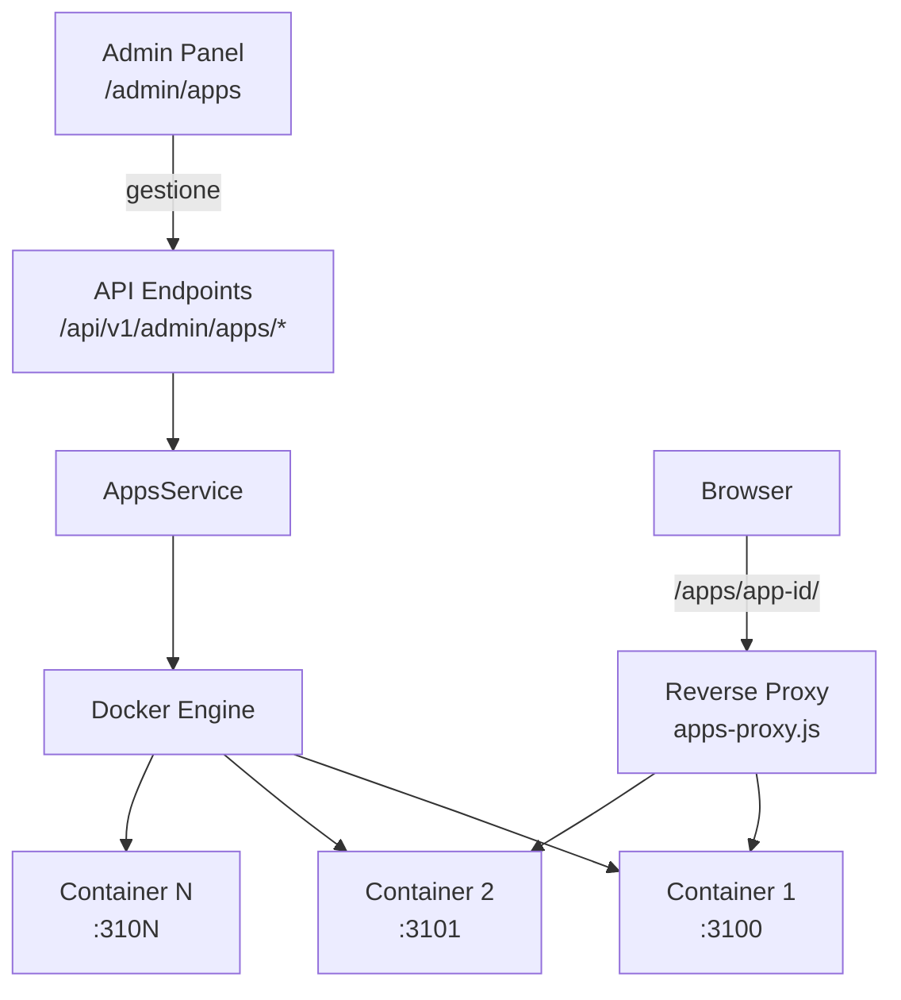

# Apps (Docker)

## Panoramica

Il sistema permette di deployare e gestire **applicazioni containerizzate** (Node.js e Dart/Flutter) all'interno della piattaforma ASP Webservices. Le app vengono servite tramite reverse proxy sullo stesso server Sails.js.

## Funzionalita

- **Upload app** da file ZIP
- **Clone app** da repository GitHub
- **Gestione lifecycle** (start, stop, restart)
- **Aggiornamento** da GitHub (git pull)
- **Visualizzazione log** dai container
- **Reverse proxy** tramite `/apps/<app-id>/`

## Architettura



### Componenti

| Componente | Path | Descrizione |
|-----------|------|-------------|
| **AppsService** | `api/services/AppsService.js` | Gestione lifecycle, Docker, filesystem |
| **Admin Panel** | `/admin/apps` | UI web per gestione app |
| **API** | `/api/v1/admin/apps/*` | Endpoint REST (superAdmin) |
| **Reverse Proxy** | `api/hooks/apps-proxy.js` | Routing `/apps/<id>/*` ai container |

## Requisiti

- **Docker** installato e in esecuzione
- **Git** (per clonare da GitHub)
- Le app devono esporre HTTP su **porta 3000** all'interno del container

## Configurazione App

Le app sono salvate in `config/custom/apps.json`:

```json
{
  "id": "mia-app",
  "name": "La Mia App",
  "description": "Descrizione",
  "type": "nodejs",
  "source": "github",
  "githubUrl": "https://github.com/user/repo",
  "branch": "main",
  "status": "running",
  "port": 3100,
  "containerId": "abc123...",
  "dockerImage": "node:22-alpine",
  "buildCommand": "npm install",
  "startCommand": "npm start"
}
```

### Docker Images Default

| Tipo App | Immagine |
|----------|----------|
| Node.js | `node:22-alpine` |
| Dart/Flutter | `dart:stable` |

### Porte

Le porte vengono assegnate automaticamente a partire da **3100**. Il sistema trova la prossima porta disponibile.

## Deploy da GitHub

1. Vai a `/admin/apps`
2. Click "Clone from GitHub"
3. Inserisci URL repository (es. `https://github.com/deduzzo/personale-convenzionato-presidi`)
4. Specifica branch (default: `main`)
5. Click "Clone & Deploy"

Il sistema:
- Clona il repository
- Legge `package.json` per ricavare l'ID app
- Rileva il tipo app (Node.js o Dart)
- Salva la configurazione
- L'app sara in stato "stopped"

## Deploy da ZIP

1. Click "Upload ZIP"
2. Seleziona file ZIP contenente l'app
3. Click "Upload & Deploy"

Il ZIP deve contenere `package.json` nella root o nella prima sottocartella.

## Accesso alle App

Le app in esecuzione sono accessibili a:

```
https://tuoserver/apps/<app-id>/
```

> Le app servite su `/apps/` sono **pubblicamente accessibili** (nessuna autenticazione richiesta).

## API Endpoints

Tutti gli endpoint richiedono JWT con livello `superAdmin` e scope `admin-manage`.

| Metodo | Endpoint | Descrizione |
|--------|----------|-------------|
| `GET` | `/api/v1/admin/apps/list` | Lista tutte le app |
| `GET` | `/api/v1/admin/apps/get?id=<id>` | Dettaglio app |
| `POST` | `/api/v1/admin/apps/clone` | Clone da GitHub |
| `POST` | `/api/v1/admin/apps/upload` | Upload ZIP |
| `POST` | `/api/v1/admin/apps/start` | Avvia container |
| `POST` | `/api/v1/admin/apps/stop` | Ferma container |
| `POST` | `/api/v1/admin/apps/restart` | Riavvia container |
| `POST` | `/api/v1/admin/apps/update` | Aggiorna da GitHub |
| `POST` | `/api/v1/admin/apps/delete` | Elimina app |
| `GET` | `/api/v1/admin/apps/logs?id=<id>&tail=100` | Log container |

## Sicurezza

- **Admin Panel**: Protetto da basic auth (stesse credenziali dell'admin)
- **API**: JWT con livello superAdmin
- **App**: Pubblicamente accessibili su `/apps/<id>`
- **Isolamento**: Ogni app gira in container Docker isolato
- **Filesystem**: File app in `.apps/` (git-ignored)

## Limitazioni

- Le app devono esporre HTTP server su porta 3000 nel container
- Solo Node.js e Dart attualmente supportati
- Nessun supporto per database dedicati (ancora)
- Nessun volume persistente (dati persi al restart container)

## Troubleshooting

**Container non parte:**
- Verificare che Docker sia in esecuzione
- Controllare che `package.json` abbia script validi
- Consultare i log nel pannello admin

**App non accessibile:**
- Verificare che il container sia in stato "running"
- Controllare che la porta non sia bloccata dal firewall
- Verificare che l'app ascolti sulla porta 3000

**Upload fallisce:**
- Verificare che il ZIP contenga `package.json` valido
- File size < 100MB
- L'ID app non deve gia esistere
