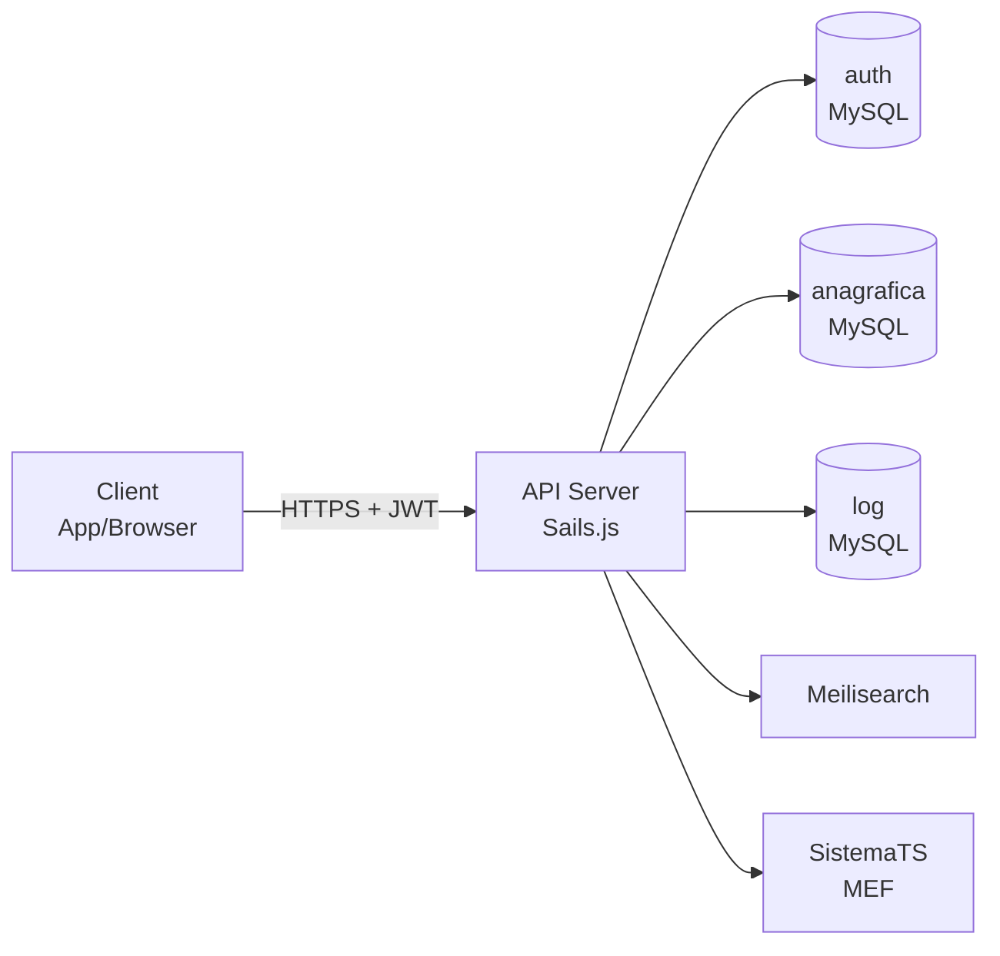

# Architettura

## Schema Generale



## Multi-Database

### Database `auth`
- **Auth_Utenti** — Account utenti con hash password (Argon2)
- **Auth_Scopi** — Permessi granulari (scope)
- **Auth_Ambiti** — Domini di accesso
- **Auth_UtentiScopi** — Associazione N:M utenti-scope
- **Auth_UtentiAmbiti** — Associazione N:M utenti-domini

### Database `anagrafica`
- **Anagrafica_Assistiti** — Dati demografici pazienti (~500k record)
- **Anagrafica_ExtraDataCategorie** — Definizioni categorie extra data con schema campi
- **Anagrafica_ExtraDataValori** — Valori extra data per assistito/categoria/chiave
- **Anagrafica_ExtraDataStorico** — Audit trail di tutte le modifiche extra data
- **Anagrafica_MpiRecord** — Record Master Patient Index
- **Anagrafica_MpiApplicazioni** — Applicazioni esterne registrate per MPI
- **Anagrafica_MpiRecordStorico** — Audit trail operazioni MPI

### Database `log`
- **Log** — Tutte le richieste API con livello, tag, IP, utente, parametri, risposta

## Migrazioni

Le migrazioni SQL vengono eseguite automaticamente al `sails lift` tramite `api/helpers/run-migrations.js`.

**Funzionamento:**
1. I file `.sql` in `migrations/` sono eseguiti in ordine alfabetico
2. Ogni database ha una tabella `_migrations` che traccia le migrazioni eseguite
3. Una migrazione non viene mai rieseguita
4. Se una migrazione fallisce, viene loggata ma non blocca le altre

**Convenzione nomi file:**
```
YYYYMMDD_NNN_descrizione.sql
```

**Header obbligatorio** in ogni file:
```sql
-- database: anagrafica
```
Valori ammessi: `anagrafica`, `auth`, `log`

## Policy e Middleware

Tutte le rotte API passano attraverso la policy `is-token-verified` che verifica:

1. **Validita JWT** — Token non scaduto e firma valida
2. **Livello autenticazione** — L'utente ha il livello minimo richiesto dalla rotta
3. **Scope** — L'utente possiede gli scope richiesti (con supporto wildcard)
4. **Dominio** — L'utente appartiene al dominio richiesto
5. **Account attivo** — L'utente non e' stato disabilitato

Il token decodificato e' esposto in `req.tokenData` con: `username`, `scopi`, `ambito`, `livello`.

## Logging

Ogni richiesta API viene automaticamente loggata nel database `log` tramite `api/helpers/log.js`:

| Campo | Descrizione |
|-------|-------------|
| livello | info, warn, error |
| tag | Categorizzazione (es. LOGIN, ANAGRAFICA, MPI) |
| azione | Descrizione operazione |
| ip | Indirizzo IP del client |
| utente | Username autenticato |
| parametri | Parametri della richiesta (sanitizzati) |
| contesto | Dettagli aggiuntivi |
