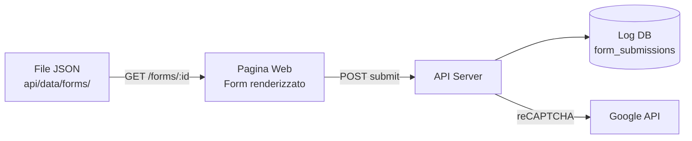

# Forms Dinamici

## Panoramica

Sistema di form dinamici serverless che permette di creare e gestire form complessi tramite semplici **file JSON**, senza necessita di modificare il codice.

I form sono definiti in `/api/data/forms/` e sono immediatamente disponibili a `/forms/{id}`.

## Come Funziona



1. Crei un file JSON nella cartella `api/data/forms/`
2. Il form e' immediatamente disponibile all'URL `/forms/{nome-file}`
3. L'utente compila e invia il form
4. I dati vengono salvati nel database `log` (tabella `form_submissions`)

## Tipi di Campi Supportati

### Campi di Testo

| Tipo | Descrizione |
|------|-------------|
| `text` | Campo singola linea |
| `textarea` | Campo multilinea |

### Campi di Selezione

| Tipo | Descrizione |
|------|-------------|
| `radio` | Scelta singola esclusiva |
| `checkbox` | Scelta multipla libera |
| `checkbox-multiple` | Scelta multipla con min/max selezioni |
| `select` | Menu a tendina (con ricerca opzionale) |

## Validazioni

Ogni campo puo avere validazioni specifiche:

| Validazione | Descrizione |
|-------------|-------------|
| `required: true` | Campo obbligatorio |
| `minLength`, `maxLength` | Lunghezza testo |
| `min`, `max` | Range numerico |
| `type: "email"` | Validazione formato email |
| `type: "telefono"` | Formato telefono italiano |
| `type: "url"` | Formato URL |
| `type: "numero"` | Solo numeri |
| `pattern` | Regex personalizzato |

## Form Multi-Pagina

- Navigazione avanti/indietro tra pagine
- Progress bar visiva
- Opzione per forzare compilazione campi obbligatori prima di procedere
- Ogni pagina con titolo e descrizione propri

## Interfaccia Utente

- Design responsive (mobile, tablet, desktop)
- Animazioni e transizioni fluide
- 2 temi: **Modern** (blu) e **Healthcare** (teal sanitario)
- Selettore tema nell'interfaccia
- Ricerca in tempo reale per opzioni multiple

**Tecnologie**: Alpine.js, Tailwind CSS, Choices.js (tutto via CDN)

## Sicurezza

### reCAPTCHA v3

- Integrazione Google reCAPTCHA v3
- Configurazione tramite `config/custom/private_recaptcha.json`
- Attivabile/disattivabile per singolo form
- Score salvato nel database

### Altre Misure

- Sanitizzazione input lato server
- Validazione formato ID form (solo caratteri sicuri)
- IP tracking per auditing
- User agent logging

## API

| Metodo | Endpoint | Descrizione |
|--------|----------|-------------|
| `GET` | `/forms/:id` | Visualizza form renderizzato (pagina web) |
| `GET` | `/api/v1/forms/:id` | Definizione JSON del form |

## Database

Tabella `form_submissions` (datastore `log`):

| Campo | Tipo | Descrizione |
|-------|------|-------------|
| `formId` | varchar | ID del form |
| `formTitle` | varchar | Titolo del form |
| `submissionData` | JSON | Dati inviati (chiave-valore) |
| `ipAddress` | varchar | IP del client |
| `userAgent` | varchar | User agent del browser |
| `recaptchaScore` | decimal | Score reCAPTCHA |
| `submittedAt` | datetime | Timestamp invio |

## Creare un Nuovo Form

### 1. Crea il file JSON

Salva in `/api/data/forms/mio-form.json`:

```json
{
  "id": "contatto-semplice",
  "title": "Form di Contatto",
  "pages": [
    {
      "id": "page-1",
      "title": "Informazioni",
      "fields": [
        {
          "id": "nome",
          "type": "text",
          "label": "Nome",
          "required": true
        },
        {
          "id": "email",
          "type": "text",
          "label": "Email",
          "required": true,
          "validation": {
            "type": "email"
          }
        },
        {
          "id": "messaggio",
          "type": "textarea",
          "label": "Messaggio",
          "required": true
        }
      ]
    }
  ]
}
```

### 2. Accedi al form

Il form e' immediatamente disponibile a: `/forms/contatto-semplice`

### 3. Configura reCAPTCHA (opzionale)

Aggiungi al JSON:

```json
{
  "recaptcha": {
    "enabled": true,
    "version": "v3",
    "action": "submit_contact_form"
  }
}
```

Configura le chiavi in `config/custom/private_recaptcha.json`.

## Opzioni Avanzate per Scelte

Ogni opzione (radio/checkbox/select) puo avere:

```json
{
  "value": "opzione1",
  "label": "Testo principale",
  "subtitle": "Sottotitolo (solo checkbox)",
  "description": "Descrizione estesa"
}
```

La ricerca filtra in tempo reale su tutti i campi (label, subtitle, description).

## Documentazione Completa

La documentazione completa della struttura JSON e' disponibile in: `/api/data/forms/README.md`
