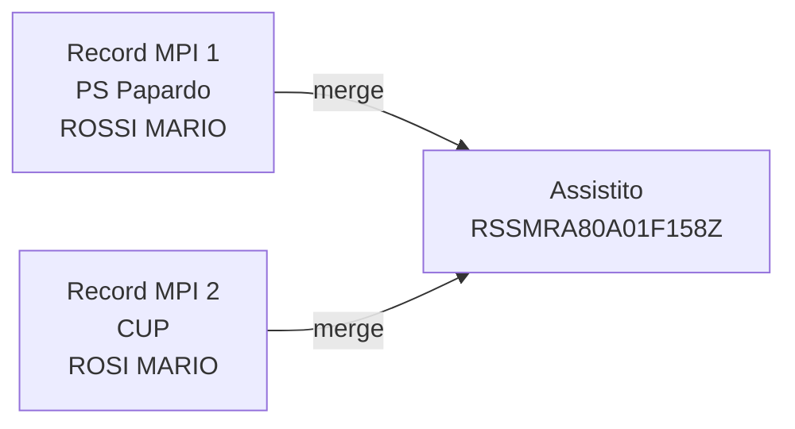

# Merge e Unmerge

> **Stato: non ancora implementato** — questa pagina descrive la funzionalita pianificata.

## Problema

Quando due record MPI (anche da applicazioni diverse) si riferiscono alla **stessa persona**, e' necessario unificarli sotto un unico assistito. Viceversa, se un merge e' stato fatto per errore, serve poterlo annullare.

## Operazioni Pianificate

### Merge (Unificazione)

Due o piu record MPI vengono collegati allo **stesso assistito**:

**Flusso previsto:**
1. L'operatore identifica due record come la stessa persona
2. Seleziona il record "principale" (quello con dati piu completi o gia identificato)
3. Il sistema collega entrambi i record allo stesso assistito
4. Gli extra data vengono **unificati** (con gestione conflitti)
5. L'operazione viene registrata nello storico di entrambi i record

### Unmerge (Separazione)

Annullamento di un merge errato:

1. L'operatore seleziona un merge da annullare
2. Il record torna allo stato precedente al merge
3. Gli extra data vengono ripristinati (dallo storico)
4. L'operazione viene registrata

### Unlink (Scollegamento)

Un record identificato viene scollegato dall'assistito e torna in stato `aperto`:

1. L'operatore seleziona un record identificato
2. Il collegamento all'assistito viene rimosso
3. Il record torna in stato `aperto`
4. I dati demografici originali del record MPI vengono ripristinati

## Riferimenti

Il protocollo HL7 v2.5 definisce questi eventi per merge/unmerge:

| Evento | Descrizione |
|--------|-------------|
| `ADT^A40` | Merge Patient - Unificazione posizioni anagrafiche |
| `ADT^A37` | Unlink Patient - Annullamento unificazione |

Nel documento "HL7 per APC v6.1", il merge (A40) invia i codici delle posizioni da unificare nei segmenti PID e MRG. L'unmerge (A37) inverte l'operazione comunicando quale posizione torna attiva.

## Note Implementative

- Il merge deve gestire i **conflitti extra data** (es. allergie diverse nei due record)
- Lo storico deve permettere il **rollback completo** di un merge
- La ricerca cross-app deve evidenziare i **potenziali duplicati** per facilitare il merge
- Il pannello admin gia include il rilevamento collisioni (stesso cognome+nome da app diverse)
