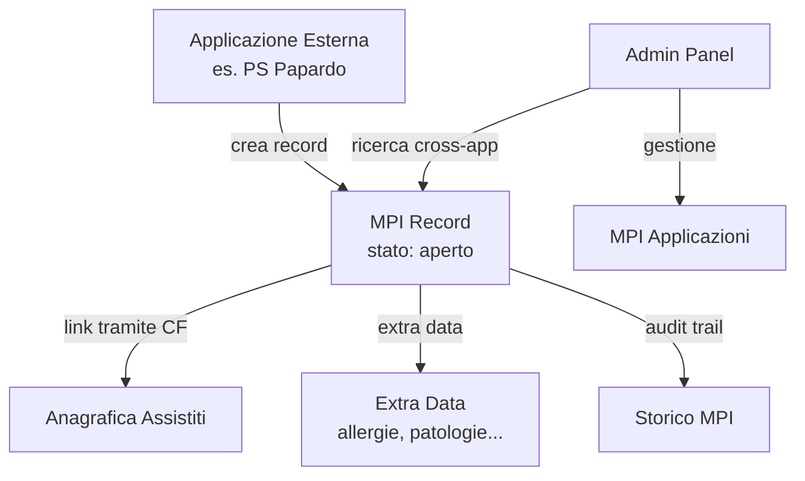

# Master Patient Index (MPI)

## Panoramica

Il **Master Patient Index** e' il sistema che permette ad applicazioni esterne (es. Pronto Soccorso, CUP, sistemi dipartimentali) di registrare pazienti e collegarli all'anagrafica centrale dell'ASP.

## Problema che risolve

Quando un'applicazione esterna gestisce un paziente, potrebbe non avere il codice fiscale o i dati completi. Il MPI permette di:

1. **Registrare** il paziente con i dati disponibili (anche parziali)
2. **Collegare** successivamente il record al paziente reale nell'anagrafica
3. **Tracciare** tutte le operazioni con un audit trail completo
4. **Associare** dati clinici (extra data) anche a pazienti non ancora identificati

## Componenti

## Modello MPI Record

Ogni record MPI ha:

| Campo | Descrizione |
|-------|-------------|
| `mpiId` | UUID univoco (generato automaticamente) |
| `codice` | Codice breve 8 caratteri alfanumerici (autogenerato, per uso umano) |
| `applicazione` | Applicazione di origine (FK a MpiApplicazioni) |
| `idEsterno` | ID del paziente nell'applicazione di origine |
| `stato` | `aperto`, `identificato`, `annullato` |
| `assistito` | Collegamento all'assistito (quando identificato) |
| `cf`, `cognome`, `nome`, `sesso`... | Dati demografici (tutti opzionali) |
| `note` | Note libere |

## API

| Metodo | Endpoint | Descrizione |
|--------|----------|-------------|
| `POST` | `/api/v1/mpi/record` | Crea nuovo record |
| `GET` | `/api/v1/mpi/record/:mpiId` | Dettaglio record |
| `PUT` | `/api/v1/mpi/record/:mpiId` | Aggiorna dati (solo se aperto) |
| `POST` | `/api/v1/mpi/record/:mpiId/link` | Collega a un assistito |
| `POST` | `/api/v1/mpi/record/:mpiId/annulla` | Annulla record |
| `GET` | `/api/v1/mpi/record/:mpiId/storico` | Audit trail |
| `POST` | `/api/v1/mpi/ricerca` | Ricerca cross-applicazione |
| `GET` | `/api/v1/mpi/record/by-assistito/:cf` | Record per assistito |
| `GET` | `/api/v1/mpi/record/by-idesterno/:idEsterno` | Record per ID esterno |

## Permessi

| Scope | Descrizione |
|-------|-------------|
| `mpi-{appCodice}-read` | Lettura record della specifica app |
| `mpi-{appCodice}-write` | Scrittura record della specifica app |
| `mpi-link` | Permesso di collegare record ad assistiti |
| `mpi-search` | Ricerca cross-applicazione |
