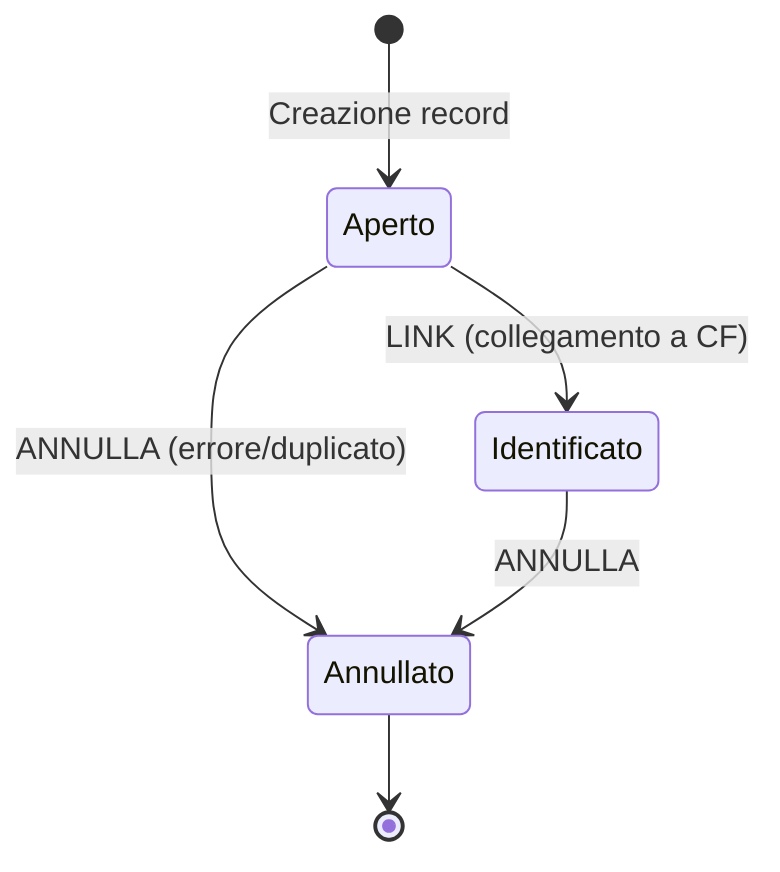

# Workflow e Stati MPI

## Diagramma Stati



## Stati

### Aperto
- Il record e' stato creato ma **non ancora collegato** a un assistito dell'anagrafica
- I dati demografici sono quelli forniti dall'applicazione esterna
- E' possibile **modificare** i dati demografici
- E' possibile **collegare** (link) il record a un assistito tramite codice fiscale
- E' possibile **annullare** il record

### Identificato
- Il record e' stato **collegato** a un assistito reale dell'anagrafica
- Il campo `assistito` contiene il riferimento all'`Anagrafica_Assistiti`
- La data e l'utente che ha effettuato il collegamento sono registrati
- **Non e' possibile modificare** i dati demografici (fanno fede quelli dell'anagrafica)
- Quando si legge il record, i dati dell'anagrafica hanno **priorita** su quelli del record MPI
- E' possibile **annullare** il record (se errato)

### Annullato
- Il record e' stato invalidato (creato per errore, duplicato, ecc.)
- **Stato terminale**: non sono possibili ulteriori transizioni
- Il motivo dell'annullamento viene registrato nello storico
- Il record resta visibile per audit trail

## Operazione: LINK

Il collegamento avviene tramite codice fiscale:

```
POST /api/v1/mpi/record/:mpiId/link
Body: { "cf": "RSSMRA80A01F158Z" }
```

**Flusso interno:**

1. Verifica che il record sia in stato `aperto`
2. Cerca l'assistito per CF nel database locale
3. Se non trovato, cerca nel **SistemaTS** (MEF) e crea l'assistito
4. Aggiorna il record: `stato = identificato`, `assistito = id_assistito`
5. Registra data e utente del collegamento
6. Scrive nello storico l'operazione LINK

## Operazione: ANNULLA

```
POST /api/v1/mpi/record/:mpiId/annulla
Body: { "motivo": "Record duplicato" }
```

**Flusso interno:**

1. Verifica che il record non sia gia annullato
2. Aggiorna stato a `annullato`
3. Registra nello storico con motivo

## Storico (Audit Trail)

Ogni operazione viene registrata nello storico:

| Operazione | Descrizione |
|-----------|-------------|
| `CREATE` | Creazione del record |
| `UPDATE` | Modifica dati demografici |
| `LINK` | Collegamento a un assistito |
| `ANNULLA` | Annullamento del record |

```
GET /api/v1/mpi/record/:mpiId/storico
```

Ogni entry dello storico contiene: operazione, utente, IP, timestamp, dettagli (vecchi e nuovi valori).

## Rilevamento Collisioni

Il pannello admin evidenzia automaticamente i record con **stesso cognome e nome** provenienti da applicazioni diverse, come possibili duplicati da investigare.
