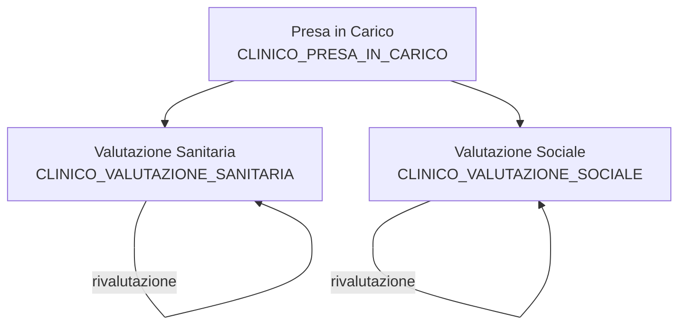

# SIAD - Assistenza Domiciliare

## Panoramica

Le categorie **SIAD** sono ispirate al flusso informativo **SIAD v7.4** (Sistema Informativo per il monitoraggio dell'Assistenza Domiciliare) del Ministero della Salute.

Il SIAD rileva le informazioni relative alle prestazioni di assistenza domiciliare, incluse le **cure domiciliari** e le **UCPDOM** (Cure Palliative Domiciliari).

## Categorie SIAD

| Categoria | Descrizione |
|-----------|-------------|
| [CLINICO_PRESA_IN_CARICO](siad/presa-in-carico.md) | Evento di presa in carico: data, richiedente, tipologia, patologie |
| [CLINICO_VALUTAZIONE_SANITARIA](siad/valutazione-sanitaria.md) | Valutazione bisogni sanitari: 37 campi clinici |
| [CLINICO_VALUTAZIONE_SOCIALE](siad/valutazione-sociale.md) | Valutazione bisogni sociali: supporto, fragilita, disturbi |

## Flusso Operativo

1. **Presa in carico**: si registra l'evento con data, soggetto richiedente, tipologia, patologie
2. **Valutazione iniziale**: si compila la scheda sanitaria (bisogni clinici) e sociale (bisogni sociali)
3. **Rivalutazione**: le valutazioni possono essere aggiornate nel tempo

## Scope

| Scope | Accesso |
|-------|---------|
| `clinico_presa_in_carico-read/write` | Presa in carico |
| `clinico_valutazione_sanitaria-read/write` | Valutazione sanitaria |
| `clinico_valutazione_sociale-read/write` | Valutazione sociale |
| `clinico_*-read/write` | **Tutte** le categorie cliniche (incluse SIAD) |

## Riferimento Normativo

- **Decreto Ministeriale 17 dicembre 2008** — Istituzione del sistema informativo per il monitoraggio dell'assistenza domiciliare
- **Decreto 7 agosto 2023** — Modifiche al decreto 2008
- **DPCM 12 gennaio 2017, art. 22** — Definizione LEA per assistenza domiciliare
- **PNRR Missione 6, Componente 1, Investimento 1.2** — Casa come primo luogo di cura e telemedicina
